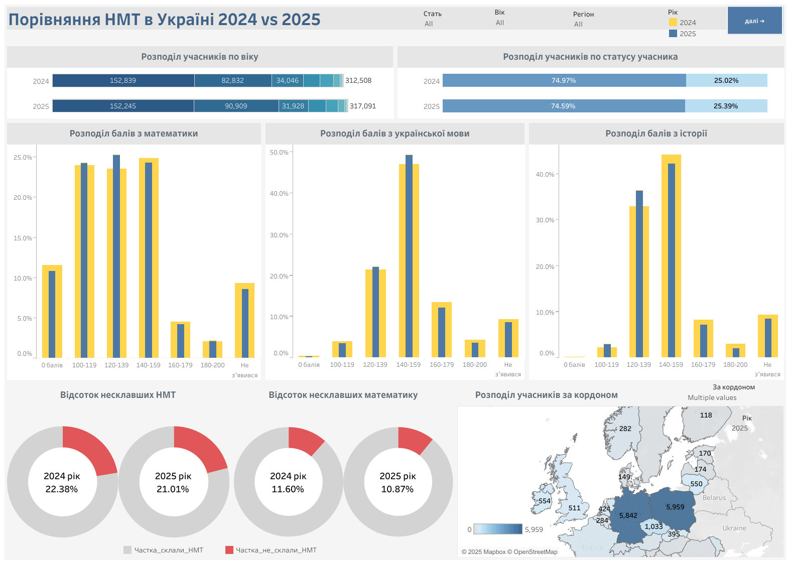
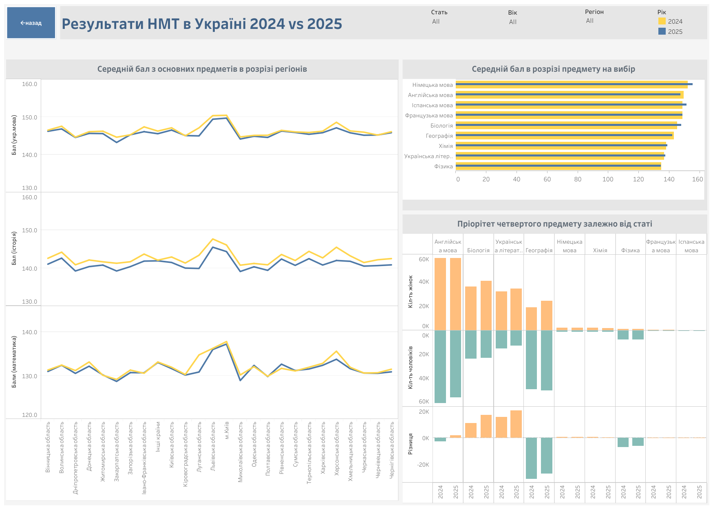

# 🎓 NMT Analysis 2024 vs 2025

## 📌 Project Overview  
This project focuses on a comparative analysis of the National Multi-Subject Test (NMT) results in Ukraine for the years 2024 and 2025.
The goal is to explore changes in student performance, subject preferences, and regional disparities in outcomes.

Analytical Scope:
- Comparing NMT results across years (2024 vs 2025)
- Analyzing participant distribution by region, age, and test status
- Investigating changes in the number of Ukrainians taking the test abroad
- Identifying regions with the highest and lowest average scores
- Assessing the share of participants who failed the test
- Exploring fourth subject choices by gender
- Detecting regional differences in educational outcomes

## 🗂️ Data Sources
[файл `Odata2024File` з деперсоніфікованими даними всіх учасників тестування 2024 року.](https://zno.testportal.com.ua/opendata)

[файл `Odata2025File` з деперсоніфікованими даними всіх учасників тестування 2025 року.](https://zno.testportal.com.ua/opendata)

## 🧰 Tools Used  
- **Python (numpy, pandas, matplotlib, seaborn, plotly, scipy.stats)** - for data cleaning, transformation, statistical analysis, and exploratory visualizations
- **Tableau** - for interactive dashboards and visual data storytelling

## 📈 Visualizations
Interactive Tableau Dashboards include filters by gender, age, year, and the region of the educational institution. They feature:
- Distribution of participants by age and test status
- Score distributions across core subjects
- Share of participants who failed the NMT, including mathematics specifically
- Distribution of participants taking the test abroad
- Average scores in core subjects by region
- Average scores by elective subject
- Fourth subject preferences by gender

[To go to this interactive dashboard](https://public.tableau.com/app/profile/yuliia.klymenko/viz/NMT_Analysis_Final_project_16_10/2024vs2025)

## 📊 Key Insights
- In 2024, 22.5% of participants failed the NMT; in 2025, this rate improved to 21%
- The most challenging subject was mathematics: failure due to math in 2024 - 11.6%, in 2025 - 10.9%
- In 2025, there was a statistically significant difference in average math subtest scores between male and female participants
- The top-performing educational institutions were located in Lviv region and Kyiv city
- The choice of the fourth subject varied by gender: female participants preferred biology and Ukrainian literature; male participants leaned toward geography and physics. However, English language was the most popular elective for both genders

## 🎯  Project Purpose
This project may be useful for:
- Educational analysts and administrators to assess the effectiveness of graduate preparation across different regions
- Educational institutions, seeking to understand their contribution to students’ NMT performance
- Researchers, exploring educational trends in Ukraine
- The general public, interested in the quality of education and changes in national test outcomes
- Future participants, looking for statistics to motivate and guide their preparation for the NM
  

## 🖋️ Author
👩‍💻 Yuliia Klymenko

Data Analyst | SQL | Python | Excel & Google Sheets | Power BI | Tableau
